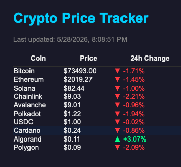

# Crypto Price Tracker and Analysis

I want to improve myself in JavaScript and Crypto & Blockchain analysis. 
So I built this — a self-learning Node.js project where I practice 
JavaScript fundamentals while building something I actually care about: 
a real crypto market analysis app.

---

## What it does

Numbers are the most important indicators in crypto. They motivate, 
protect, and minimize risk. This app puts the numbers in front of you.

- Fetches real-time prices for 10 cryptocurrencies from the CoinGecko API
- Displays 24h price change for each coin with ▲ ▼ indicators
- Shows top gainer, top loser, and total portfolio value
- Saves every snapshot to a SQLite database — not a flat file, a real DB
- Analyzes session data: min, max, avg price per coin, biggest mover, 
  most volatile coin, and session duration

---

## What I practiced

Now let's talk grown up things:

- Variables, Functions, Arrays, Loops
- Objects and `.sort()`, `.reduce()`, `.map()`, `.find()`
- `fetch`, `async/await`, JSON
- `try/catch` error handling
- File I/O with `fs`
- SQLite database with `better-sqlite3`
- SQL queries inside JavaScript
- API integration with rate limit handling
- Refactoring and separation of concerns

---

## How to run

Terminal and Node.js required.

**Live tracker:**
node practice.js

**Session analysis:**
node analyze.js

---

## Sample output

Snapshots: 1131
Duration: 563 mins
Bitcoin:   $75752 → $74668   -1.43%
Ethereum:  $2081  → $2045    -1.76%
Algorand:  $0.108 → $0.106   -2.21%
--- SESSION SUMMARY ---
Top Gainer:    USDC
Top Loser:     Algorand  -2.21%
Most Volatile: Bitcoin

---
## Dashboard

Run `node server.js` and open `http://localhost:3000` to see the live dashboard.
Click any coin to see its full price history chart.

